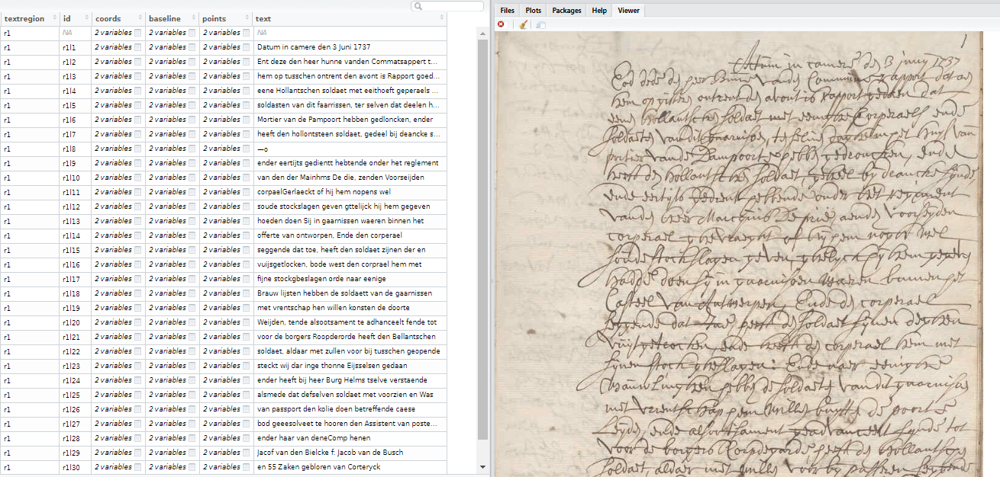

---
output:
  md_document:
    variant: markdown_github
---

```{r, include=FALSE}
knitr::opts_chunk$set(comment = "#>", fig.path = "tools/")
```

# madoc.utils

This repository contains an R package for 
  - extracting data from Madoc
  - uploading images and transcribing images using the Transkribus API

> 'Madoc' is an 'Omeka S' based platform for the display, enrichment, and curation of digital objects in  'IIIF' format. The platform can be used for all kinds of crowdsourcing activities in the domain of digital humanities.

### Installation

- For installing the development version of this package: `remotes::install_github("DIGI-VUB/madoc.utils")`

### Example on Transkribus

- Create a collection, upload a document, transcribe it

```{r, transkribus}
library(madoc.utils)
library(magick)
img <- c(system.file(package = "madoc.utils", "extdata", "example.png"),
         system.file(package = "madoc.utils", "extdata", "alto-example.jpg"))
image_read(img)

## Connect using your user/password
api <- Transkribus$new(user = "jan.wijffels@vub.ac.be", password = Sys.getenv("TRANSKRIBUS_PWD"))
## Look which collections you have
api$list_collections()
## create a new collection, upload 1 document with 2 image
api$create_collection(label = "test-collection")
api$upload(data = img, collection = "test-collection", title = "Example document", author = "R-API-example")
## Transcribe one page using  Dutch Mountains HTR+ (model id 21683) + Inspect if your job is finished
job <- api$transcribe(collection = "test-collection", document = "Example document", page = 1, 
                      model  = 21683, dictionary = "Combined_Dutch_Model_M1.dict")
api$list_job(job = job)

## list all documents part of the collection + get the pages of 1 document
docs   <- api$list_collection(collection = "test-collection")
pages  <- api$list_document(collection = "test-collection", document = "Example document")
## Once your job finished, import the PageXML file 
pages  <- head(pages, n = 1)
x      <- read_pagexml(pages$page_xml) 
View(x)
img <- image_read(pages$url)
img <- image_draw_baselines(img, x$baseline, lwd = 4, col = "darkgreen")
image_resize(img, "800x")

## Delete the collection if you want to remove all your work
api$delete_collection(collection = "test-collection")
```



### Example on Madoc

- Get transcriptions

```{r, data-extraction}
library(madoc.utils)
site         <- "https://www.madoc.ugent.be/s/brugse-vrije"

## Get all projects on that madoc site
projects     <- madoc_projects(site)
projects     <- subset(projects, slug == "brugse-vrije-gebruikerstest")
projects

## Get all manifests and canvasses of a collection
manifests <- list()
manifests <- madoc_collection(site = site, id = projects$collection_id, tidy_metadata = TRUE)
canvasses <- madoc_manifest(site = site,   id = manifests$manifest_id)

## Get annotations on a canvas or several canvasses
annotations  <- madoc_canvas_model(site = site, id = canvasses$canvas_id)
anno         <- subset(annotations, nchar(value) > 0)

## Get URL of canvas for which volunteers performed an annotation
images <- madoc_canvas_image(site = site, id = sort(unique(anno$canvas_id)))
images <- merge(images, canvasses, by = "canvas_id")
images <- images[, c("manifest_id", "canvas_id", "height", "width", "image_url")]
```

- Combine annotations with image url and manifest metadata

```{r, data-export}
anno <- merge(images, anno, by = "canvas_id", all.x = TRUE, all.y = FALSE)
anno <- merge(anno, manifests, by = "manifest_id", all.x = TRUE, all.y = FALSE, suffixes = c("", "_manifest"))
anno <- subset(anno, !is.na(value) & nchar(value) > 0)
str(anno)

library(writexl)
write_xlsx(anno, "brugse-vrije.xlsx")
```

- See the image of a canvas

```{r, img-example}
library(magick)
url  <- anno$image_url[[1]]
url
img  <- image_read(url)
img  <- image_resize(img, "x800")
txt  <- anno$value[[1]]

trans <- image_blank(width = image_info(img)$width, height = image_info(img)$height)
trans <- image_annotate(trans, txt, size = 10, color = "green")
image_append(c(img, trans))
```


### DIGI

By DIGI: Brussels Platform for Digital Humanities: https://digi.research.vub.be


