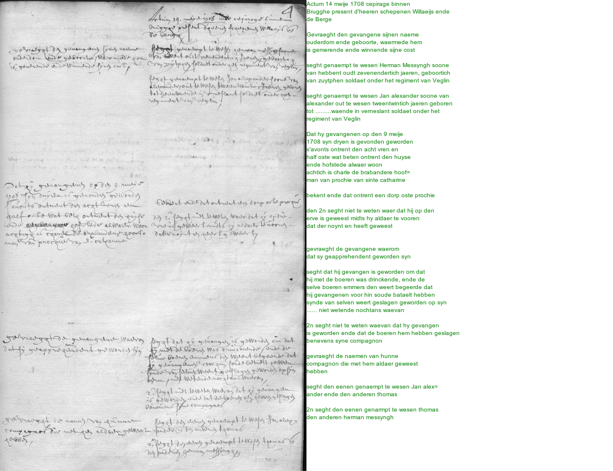

# madoc.utils

This repository contains an R package for extracting data from Madoc.

> ‘Madoc’ is an ‘Omeka S’ based platform for the display, enrichment,
> and curation of digital objects in ‘IIIF’ format. The platform can be
> used for all kinds of crowdsourcing activities in the domain of
> digital humanities.

### Installation

-   For installing the development version of this package:
    `remotes::install_github("DIGI-VUB/madoc.utils")`

### Example

-   Get transcriptions

``` r
library(madoc.utils)
site         <- "https://www.madoc.ugent.be/s/brugse-vrije"

## Get all projects on that madoc site
projects     <- madoc_projects(site)
projects     <- subset(projects, slug == "brugse-vrije-gebruikerstest")
projects
```

    #>   project_id collection_id                        slug        label summary
    #> 1         12          2746 brugse-vrije-gebruikerstest Brugse Vrije

``` r
## Get all manifests and canvasses of a collection
manifests    <- madoc_collection(site = site, id = projects$collection_id)
head(manifests, n = 3)
```

    #>   collection_id manifest_id       type
    #> 1          2746         398 collection
    #> 2          2746         421   manifest
    #> 3          2746         399   manifest
    #>                                                    label canvasCount
    #> 1 Collectie Brugse Vrije - Gebruikerstest - Brugse Vrije         193
    #> 2                                             Subject 26           1
    #> 3                                              Subject 2           5
    #>                                                                                                                                          thumbnail
    #> 1                                                                                                                                             <NA>
    #> 2 https://iiif.ghentcdh.ugent.be/iiif/images/getuigenissen:brugse_vrije:RABrugge_I15_16999_V26:RABrugge_I15_16999_V26_01/full/84,135/0/default.jpg
    #> 3 https://iiif.ghentcdh.ugent.be/iiif/images/getuigenissen:brugse_vrije:RABrugge_I15_16999_V02:RABrugge_I15_16999_V02_01/full/83,128/0/default.jpg
    #>       metadata
    #> 1 characte....
    #> 2 c("Id", ....
    #> 3 c("Id", ....

``` r
manifests    <- head(manifests, 10)
canvasses    <- madoc_manifest(site = site,   id = manifests$manifest_id)
str(canvasses)
```

    #> 'data.frame':    51 obs. of  6 variables:
    #>  $ manifest_id       : int  421 399 399 399 399 399 400 400 400 400 ...
    #>  $ manifest_label    : chr  "Subject 26" "Subject 2" "Subject 2" "Subject 2" ...
    #>  $ manifest_thumbnail: chr  "https://iiif.ghentcdh.ugent.be/iiif/images/getuigenissen:brugse_vrije:RABrugge_I15_16999_V26:RABrugge_I15_16999"| __truncated__ "https://iiif.ghentcdh.ugent.be/iiif/images/getuigenissen:brugse_vrije:RABrugge_I15_16999_V02:RABrugge_I15_16999"| __truncated__ "https://iiif.ghentcdh.ugent.be/iiif/images/getuigenissen:brugse_vrije:RABrugge_I15_16999_V02:RABrugge_I15_16999"| __truncated__ "https://iiif.ghentcdh.ugent.be/iiif/images/getuigenissen:brugse_vrije:RABrugge_I15_16999_V02:RABrugge_I15_16999"| __truncated__ ...
    #>  $ canvas_id         : int  698 590 592 594 595 596 597 598 599 600 ...
    #>  $ canvas_thumbnail  : chr  "https://iiif.ghentcdh.ugent.be/iiif/images/getuigenissen:brugse_vrije:RABrugge_I15_16999_V26:RABrugge_I15_16999"| __truncated__ "https://iiif.ghentcdh.ugent.be/iiif/images/getuigenissen:brugse_vrije:RABrugge_I15_16999_V02:RABrugge_I15_16999"| __truncated__ "https://iiif.ghentcdh.ugent.be/iiif/images/getuigenissen:brugse_vrije:RABrugge_I15_16999_V02:RABrugge_I15_16999"| __truncated__ "https://iiif.ghentcdh.ugent.be/iiif/images/getuigenissen:brugse_vrije:RABrugge_I15_16999_V02:RABrugge_I15_16999"| __truncated__ ...
    #>  $ is_published      : logi  TRUE TRUE TRUE TRUE TRUE TRUE ...

``` r
## Get annotations on a canvas or several canvasses
annotations  <- madoc_canvas_model(site = site, id = canvasses$canvas_id)
head(subset(annotations, nchar(value) > 0))
```

    #>  [1] document_id    document_type  document_label model_id       id            
    #>  [6] type           value          label          id_revision    id_revises    
    #> [11] selector_state selector_type  selector_id    canvas_id     
    #> <0 rows> (or 0-length row.names)

-   See the image of a canvas

``` r
library(magick)
```

    #> Warning: package 'magick' was built under R version 4.1.1

    #> Linking to ImageMagick 6.9.12.3
    #> Enabled features: cairo, freetype, fftw, ghostscript, heic, lcms, pango, raw, rsvg, webp
    #> Disabled features: fontconfig, x11

``` r
canvasses_urls <- madoc_canvas_image(site, id = sample(canvasses$canvas_id, size = 10))
x              <- merge(canvasses, canvasses_urls, by = "canvas_id")
url            <- unlist(x$image_url[[1]])
image_read(url)
```



### DIGI

By DIGI: Brussels Platform for Digital Humanities:
<https://digi.research.vub.be>


